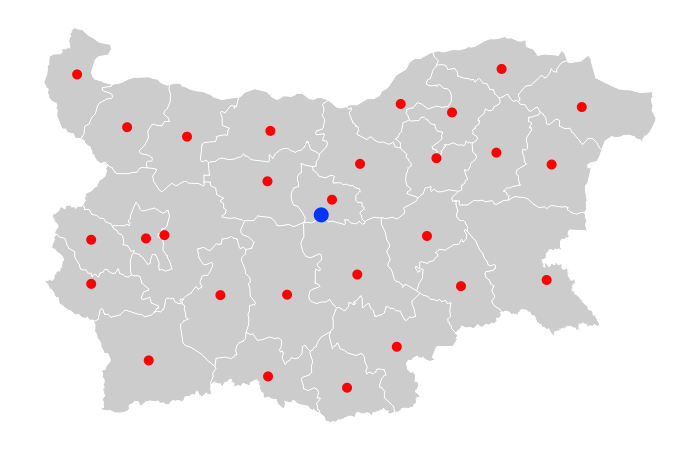

# Centroids of Bulgaria
## Mapping Location Data Project

#### Author: Tsvetan Tsonev

### Preface

Many years ago, I came upon the information that the geographic center of Bulgaria is somewhere near Gabrovo. As a primary school student, I couldn't imagine how the scientists behind the study had calculated this point. I was very impressed and love the geographic data ever since.

Unfortunately, the scientific field of so called "location intelligence" (LI) is not well developed in Bulgaria as opposed to the worldwide standards. We still miss a lot of information, but more and more people and organizations are working on it to fill the gaps and find new interesting insights.

Some good examples of Bulgarian projects are:
https://morphocode.com
https://www.infograf.bg

### Step 1: Setting the Goals
* I decided to try to find out the mean center (centroid) of all the Bulgarian districts.
* My preferred choice of programming language is Python. So, I need to work out a solution that is Python based.
* I need to find a way to plot the output in visual environment.
* I need to define future goals connected to the study.

### Step 2: Defining Process
* Find a way to map each district in Bulgaria as a polygon. The borders of the polygon would be the 2-D points (latitude, longitude).
* Transform the data in code-friendly format.
* Calculate the centroid of each district.
* Plot the final results on a map.

### Step 3: Implement the Plan
#### Draw Polygons
I put a lot of effort to find out some information about the GPS coordinates of the main points on district borders, but it was close to a total failure. After all I managed to find some maps in the https://github.com/yurukov/Bulgaria-geocoding, thanks to Boyan Yurukov's article https://yurukov.net/blog/2015/zemlishta/.
There was no map of the Bulgarian districts there, but I came across the idea of looking for a vector image file, from which I can try to export the data I needed.
I found .svg file, which seemed to work for me.

  
  (https://www.amcharts.com/svg-maps/?map=bulgaria)

The easiest way to export the data in .svg file is to open it with text editor as WordPad for example.
The data looks similar to:

```html
<svg height="210" width="400">
  <path d="M150, 0 L75, 200 L225, 200 Z" />
</svg>
```

where:

* M = moveto
* L = lineto
* H = horizontal lineto
* V = vertical lineto
* C = curveto
* S = smooth curveto
* Q = quadratic Bézier curve
* T = smooth quadratic Bézier curveto
* A = elliptical Arc
* Z = closepath

*Note: All of the commands above can also be expressed with lower letters. Capital letters means absolutely positioned, lower cases means relatively positioned. (Burgas district was with relative points, which led to sоme difficulties)*

#### Transform the Data

I used MS Excel to convert the data into GPS coordinates and calibrate the map based on the known location of the northern, southern, eastern and western extreme points. (https://bg.wikipedia.org/wiki/Крайни_точки_на_България)

| Code  | District    | # | SVG long | SVG high |   | Latitude  | Longitude |
|-------|-------------|---|----------|----------|---|-----------|-----------|
| BG-01 | Blagoevgrad | 1 | 110.46   | 284.93   |   | 42.068521 | 23.485657 |
| BG-01 | Blagoevgrad | 2 | 113.11   | 283.95   |   | 42.075895 | 23.512732 |
| BG-01 | Blagoevgrad | 3 | 116.27   | 284.70   |   | 42.070252 | 23.545016 |
| BG-01 | Blagoevgrad | 4 | 118.87   | 282.67   |   | 42.085526 | 23.57158  |

*Note: In the .svg file the first value is the length which corresponds to the longitude*

#### Calculating Centroids

To calculate the centroids, first I installed Shapely which is a BSD-licensed Python package for manipulation and analysis of planar geometric objects.


#### Plotting the Final Results

I used CorelDraw to put the dots on the exact location on the image.



### Future development

There are a lot of different center points in the location intelligence studies which are still not applied on the Bulgarian map. It will be interesting to find them, analyse their movement over time (if applicable) and get a meaningful insights.

The next goals in this study will be:

* Economic center of gravity (GDP weighted)
* Center of population (population weighted)
* Geometric median - Fermat–Weber point or point of minimum aggregate travel

### References

1. Sumit Kumar Arora - Plotting Population Weighted Mean Centroids on a Country Map (https://medium.com/@sumit.arora/plotting-weighted-mean-population-centroids-on-a-country-map-22da408c1397)
2. AmCharts - Free SVG Maps (https://www.amcharts.com/svg-maps/)
3. Boyan Yurukov - Geocoding resources for Bulgaria (https://github.com/yurukov/Bulgaria-geocoding)
4. W3Schools - SVG Paths (https://www.w3schools.com/graphics/svg_path.asp)
5. StackExchange - Geographic Information Systems (https://gis.stackexchange.com/questions/29349/how-should-i-go-about-calculating-the-centroid-of-several-lat-long-points-in-pyt)
6. Wikipedia - Center of mass (https://en.wikipedia.org/wiki/Center_of_mass#Center_of_gravity)
